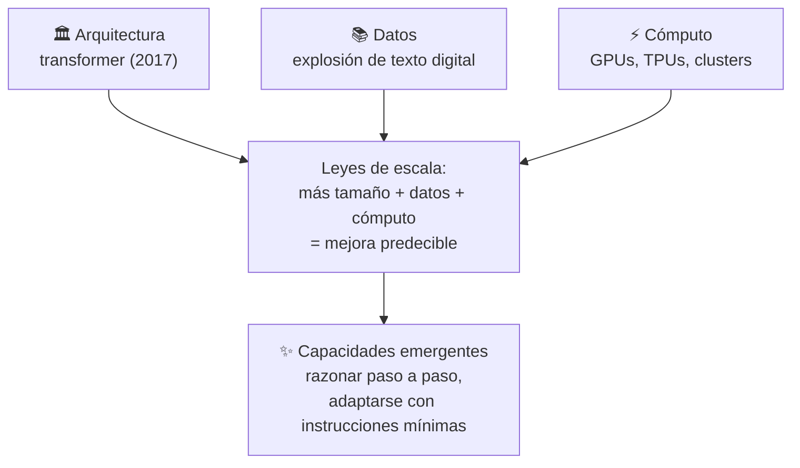
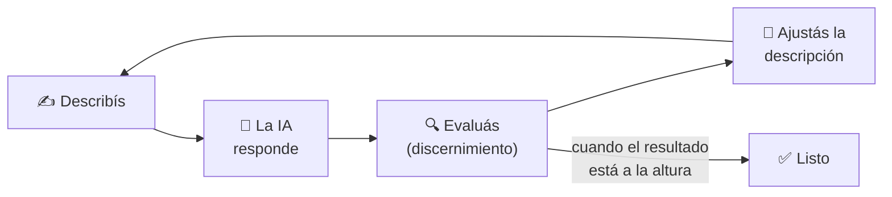

# Aprender a usar la IA: fundamentos y el marco 4D de fluidez

La IA generativa es un tipo de inteligencia artificial que **crea contenido nuevo**, en lugar de solo analizar datos existentes. La diferencia con la IA tradicional es clave: un clasificador de spam analiza y categoriza un mail que ya existe; un modelo generativo puede escribir un mail nuevo desde cero. El primer enfoque analiza y clasifica; el segundo **crea algo que no existía**.

Los **modelos de lenguaje grandes** (LLM, por *large language models*), son el tipo de IA generativa más conocido hoy. Se llaman "de lenguaje" porque están entrenados para predecir y generar lenguaje humano, y "grandes" porque contienen miles de millones de parámetros — valores matemáticos que determinan cómo el modelo procesa la información, de forma parecida a las conexiones sinápticas del cerebro.

### Cómo se llegó hasta acá

El salto no fue repentino. Confluyeron tres desarrollos:

1. **Arquitectura**: la arquitectura *transformer*, presentada en 2017, cambió la forma en que los sistemas de IA procesan secuencias de texto manteniendo relaciones entre palabras a lo largo de pasajes largos — algo crítico para entender el lenguaje en contexto.
2. **Datos**: la explosión de datos digitales (webs, repositorios de código, texto de todo tipo) le dio a los modelos la materia prima para desarrollar una comprensión amplia y matizada del lenguaje y los conceptos.
3. **Poder de cómputo**: hardware especializado (GPUs, TPUs) y redes de cómputo distribuido (clusters) hicieron posible entrenar modelos sobre todos esos datos.

La combinación de estos tres factores llevó a un hallazgo importante: las **leyes de escala** (*scaling laws*). A medida que los modelos crecen y se entrenan con más datos y más cómputo, su rendimiento mejora de forma predecible — y, más sorprendente aún, aparecen **capacidades emergentes** que nadie programó explícitamente, como razonar paso a paso o adaptarse a tareas nuevas con instrucciones mínimas.

### Cómo se entrena un modelo

El entrenamiento tiene dos fases:

- **Preentrenamiento**: el modelo analiza patrones en miles de millones de ejemplos de texto, prediciendo qué palabra viene después una y otra vez. Al final de esta fase construye algo así como un mapa complejo del lenguaje y el conocimiento — pero es, literalmente, un "completador de documentos" muy competente, nada más.
- **Ajuste fino (fine-tuning)**: el modelo aprende a seguir instrucciones, dar respuestas útiles y evitar contenido dañino. Acá entra el feedback humano y el aprendizaje por refuerzo, que premia y penaliza comportamientos para hacer el modelo más útil, honesto e inofensivo.

<svg viewBox="0 0 920 340" xmlns="http://www.w3.org/2000/svg" width="760">
  <defs>
    <marker id="arrowTrain" viewBox="0 0 10 10" refX="8" refY="5" markerWidth="7" markerHeight="7" orient="auto-start-reverse">
      <path d="M0,0 L10,5 L0,10 z" fill="#333333"/>
    </marker>
  </defs>

  <rect x="0" y="0" width="920" height="340" rx="12" fill="#ffffff"/>

  <!-- Datos de entrada -->
  <rect x="15" y="85" width="150" height="55" rx="8" fill="#eeeeee" stroke="#999999" stroke-width="1.5"/>
  <text x="90" y="107" text-anchor="middle" font-family="Arial, Helvetica, sans-serif" font-size="12" fill="#555555">📚 Miles de millones</text>
  <text x="90" y="123" text-anchor="middle" font-family="Arial, Helvetica, sans-serif" font-size="12" fill="#555555">de ejemplos de texto</text>
  <line x1="165" y1="112" x2="200" y2="112" stroke="#333333" stroke-width="2" marker-end="url(#arrowTrain)"/>

  <!-- Fase 1 -->
  <rect x="205" y="40" width="310" height="280" rx="14" fill="#eef3fa" stroke="#5b7fa6" stroke-width="2.5"/>
  <text x="360" y="65" text-anchor="middle" font-family="Arial, Helvetica, sans-serif" font-size="16" font-weight="700" fill="#2d4a6b">Fase 1 · Preentrenamiento</text>

  <rect x="225" y="85" width="270" height="55" rx="8" fill="#dce8f5" stroke="#5b7fa6" stroke-width="1.5"/>
  <text x="360" y="110" text-anchor="middle" font-family="Arial, Helvetica, sans-serif" font-size="13" fill="#22384f">Predecir qué palabra viene</text>
  <text x="360" y="126" text-anchor="middle" font-family="Arial, Helvetica, sans-serif" font-size="13" fill="#22384f">después, una y otra vez</text>
  <line x1="360" y1="140" x2="360" y2="158" stroke="#333333" stroke-width="2" marker-end="url(#arrowTrain)"/>

  <rect x="225" y="158" width="270" height="55" rx="8" fill="#dce8f5" stroke="#5b7fa6" stroke-width="1.5"/>
  <text x="360" y="190" text-anchor="middle" font-family="Arial, Helvetica, sans-serif" font-size="13" fill="#22384f">Construye un mapa del lenguaje</text>
  <text x="360" y="206" text-anchor="middle" font-family="Arial, Helvetica, sans-serif" font-size="13" fill="#22384f">y el conocimiento</text>
  <line x1="360" y1="213" x2="360" y2="231" stroke="#333333" stroke-width="2" marker-end="url(#arrowTrain)"/>

  <rect x="225" y="231" width="270" height="55" rx="8" fill="#3f6690"/>
  <text x="360" y="255" text-anchor="middle" font-family="Arial, Helvetica, sans-serif" font-size="13" font-weight="700" fill="#ffffff">Modelo base:</text>
  <text x="360" y="272" text-anchor="middle" font-family="Arial, Helvetica, sans-serif" font-size="13" font-weight="700" fill="#ffffff">solo "completa documentos"</text>

  <!-- Conector entre fases -->
  <path d="M495,258 L545,258 L545,112 L575,112" fill="none" stroke="#333333" stroke-width="2" marker-end="url(#arrowTrain)"/>

  <!-- Fase 2 -->
  <rect x="580" y="40" width="310" height="280" rx="14" fill="#faf3e6" stroke="#c9922f" stroke-width="2.5"/>
  <text x="735" y="65" text-anchor="middle" font-family="Arial, Helvetica, sans-serif" font-size="16" font-weight="700" fill="#8a5a12">Fase 2 · Ajuste fino</text>

  <rect x="600" y="85" width="270" height="55" rx="8" fill="#f3e6cc" stroke="#c9922f" stroke-width="1.5"/>
  <text x="735" y="110" text-anchor="middle" font-family="Arial, Helvetica, sans-serif" font-size="13" fill="#5c3f0d">Seguir instrucciones y dar</text>
  <text x="735" y="126" text-anchor="middle" font-family="Arial, Helvetica, sans-serif" font-size="13" fill="#5c3f0d">respuestas útiles y seguras</text>
  <line x1="735" y1="140" x2="735" y2="158" stroke="#333333" stroke-width="2" marker-end="url(#arrowTrain)"/>

  <rect x="600" y="158" width="270" height="55" rx="8" fill="#f3e6cc" stroke="#c9922f" stroke-width="1.5"/>
  <text x="735" y="190" text-anchor="middle" font-family="Arial, Helvetica, sans-serif" font-size="13" fill="#5c3f0d">Feedback humano +</text>
  <text x="735" y="206" text-anchor="middle" font-family="Arial, Helvetica, sans-serif" font-size="13" fill="#5c3f0d">aprendizaje por refuerzo</text>
  <line x1="735" y1="213" x2="735" y2="231" stroke="#333333" stroke-width="2" marker-end="url(#arrowTrain)"/>

  <rect x="600" y="231" width="270" height="55" rx="8" fill="#b8791f"/>
  <text x="735" y="255" text-anchor="middle" font-family="Arial, Helvetica, sans-serif" font-size="13" font-weight="700" fill="#ffffff">Modelo asistente:</text>
  <text x="735" y="272" text-anchor="middle" font-family="Arial, Helvetica, sans-serif" font-size="13" font-weight="700" fill="#ffffff">útil, honesto e inofensivo</text>
</svg>

### Cómo funciona una interacción

Cuando le escribís a un LLM, le estás dando un **prompt**: texto que el modelo lee y continúa según los patrones que aprendió durante el entrenamiento. El modelo no busca respuestas prearmadas en una base de datos — genera texto nuevo que sigue estadísticamente a lo que escribiste.

Hay un límite práctico a cuánta información puede considerar un LLM a la vez: la **ventana de contexto**, algo así como su memoria de trabajo. Incluye tu prompt, las respuestas del modelo y todo lo demás que compartiste en la conversación. Aunque las empresas de IA la agrandan cada vez más, sigue siendo un límite real: el modelo no tiene acceso ilimitado a información y no puede usar contenido fuera de esa ventana sin herramientas especializadas (como búsqueda web).

<svg viewBox="0 0 780 270" xmlns="http://www.w3.org/2000/svg" width="720">
  <rect x="0" y="0" width="780" height="270" rx="12" fill="#ffffff"/>

  <rect x="20" y="60" width="150" height="150" rx="10" fill="none" stroke="#b0b0b0" stroke-width="2" stroke-dasharray="7 5"/>
  <text x="95" y="115" text-anchor="middle" font-family="Arial, Helvetica, sans-serif" font-size="15" fill="#999999">Mensajes más</text>
  <text x="95" y="135" text-anchor="middle" font-family="Arial, Helvetica, sans-serif" font-size="15" fill="#999999">viejos: quedan</text>
  <text x="95" y="155" text-anchor="middle" font-family="Arial, Helvetica, sans-serif" font-size="15" fill="#999999">afuera primero</text>

  <rect x="210" y="30" width="360" height="210" rx="12" fill="#eef3fa" stroke="#5b7fa6" stroke-width="3"/>
  <text x="390" y="60" text-anchor="middle" font-family="Arial, Helvetica, sans-serif" font-size="17" font-weight="700" fill="#2d4a6b">Ventana de contexto</text>
  <text x="390" y="80" text-anchor="middle" font-family="Arial, Helvetica, sans-serif" font-size="13" fill="#2d4a6b">(memoria de trabajo)</text>

  <rect x="240" y="100" width="300" height="34" rx="8" fill="#5b7fa6"/>
  <text x="390" y="122" text-anchor="middle" font-family="Arial, Helvetica, sans-serif" font-size="14" fill="#ffffff">Tu prompt</text>
  <rect x="240" y="144" width="300" height="34" rx="8" fill="#7595b8"/>
  <text x="390" y="166" text-anchor="middle" font-family="Arial, Helvetica, sans-serif" font-size="14" fill="#ffffff">Respuestas del modelo</text>
  <rect x="240" y="188" width="300" height="34" rx="8" fill="#93acca"/>
  <text x="390" y="210" text-anchor="middle" font-family="Arial, Helvetica, sans-serif" font-size="14" fill="#ffffff">Resto de la conversación</text>

  <rect x="610" y="60" width="150" height="150" rx="10" fill="none" stroke="#b0b0b0" stroke-width="2" stroke-dasharray="7 5"/>
  <text x="685" y="110" text-anchor="middle" font-family="Arial, Helvetica, sans-serif" font-size="15" fill="#999999">Web, archivos,</text>
  <text x="685" y="130" text-anchor="middle" font-family="Arial, Helvetica, sans-serif" font-size="15" fill="#999999">datos externos:</text>
  <text x="685" y="150" text-anchor="middle" font-family="Arial, Helvetica, sans-serif" font-size="15" fill="#999999">solo entran con</text>
  <text x="685" y="170" text-anchor="middle" font-family="Arial, Helvetica, sans-serif" font-size="15" fill="#999999">herramientas</text>
</svg>

## Fortalezas y límites de los LLM

### Lo que hace bien

- **Versatilidad lingüística**: redactar mails con tu voz, condensar informes extensos, traducir, explicar temas complejos de cualquier campo.
- **Aprendizaje en contexto**: puede pasar de ayudarte a escribir poesía a explicarte computación cuántica, sin entrenamiento adicional — solo con lo que le das en la conversación.
- **Memoria conversacional**: mantiene el hilo de la charla, recuerda lo que se dijo antes y construye sobre eso.
- **Uso de herramientas externas**: muchos LLM  pueden conectarse a la web, procesar archivos o usar otras aplicaciones, lo que expande mucho lo que pueden ayudarte a hacer.

### Dónde falla — y por qué

Cada límite se explica por cómo funciona el modelo por dentro:

- **Fecha de corte del conocimiento.** El modelo no sabe nada de lo que pasó después de su fecha de entrenamiento. ºNecesita herramientas como búsqueda web para enterarse de novedades.
- **Alucinaciones.** El entrenamiento no verifica cada dato, así que el modelo puede reproducir inexactitudes o combinar mal la información que aprendió, afirmando con total confianza algo que suena plausible pero es incorrecto. A diferencia de un buscador, que recupera documentos existentes, un LLM genera texto según patrones estadísticos — y ahí puede alucinar.
- **Límite de ventana de contexto.** Si una conversación o documento la supera, el modelo deja de "ver" lo que quedó afuera (normalmente lo más viejo primero).
- **No determinismo.** A diferencia del software tradicional, un LLM no siempre da la misma respuesta ante la misma pregunta — toma decisiones probabilísticas sobre qué texto sigue. Esto es útil para brainstorming, pero hay que tenerlo en cuenta cuando necesitás consistencia o precisión. Algunas interfaces exponen este control como "temperatura".
- **Razonamiento complejo.** Históricamente los LLM flaquean en problemas matemáticos o lógicos de varios pasos, aunque los modelos de razonamiento extendido (*extended thinking*) vienen mejorando mucho en esto.
- **Acceso a datos y herramientas específicas.** Aunque un modelo pueda usar herramientas externas, si no tiene acceso a una fuente de datos o herramienta puntual, no va a poder ayudarte con eso — como un colega brillante sin acceso a la base de datos interna de tu empresa.

## El marco 4D para la fluidez en IA

Usar bien la IA no es solo saber escribir un buen prompt. Es un conjunto de hábitos que se entrenan, y se puede resumir en cuatro competencias interconectadas: el **marco 4D**.

Las cuatro competencias son:

- **Descripción** (Delineation)
- **Discernimiento** (Discernment)
- **Delegación** (Delegation)
- **Diligencia debida** (Diligence)

Se organizan en dos ciclos que conviven todo el tiempo: uno **interno**, que pasa dentro de cada conversación con la IA, y uno **externo**, que pasa alrededor de esa conversación — en tu trabajo, tu equipo, tu responsabilidad.

<svg viewBox="0 0 600 560" xmlns="http://www.w3.org/2000/svg" width="480">
  <defs>
    <marker id="arrow4d" viewBox="0 0 10 10" refX="8" refY="5" markerWidth="7" markerHeight="7" orient="auto-start-reverse">
      <path d="M0,0 L10,5 L0,10 z" fill="#111111"/>
    </marker>
  </defs>

  <rect x="0" y="0" width="600" height="560" rx="12" fill="#ffffff"/>

  <path d="M115,190 Q160,110 215,65" fill="none" stroke="#111111" stroke-width="2.5" marker-start="url(#arrow4d)" marker-end="url(#arrow4d)"/>
  <path d="M385,65 Q440,110 485,190" fill="none" stroke="#111111" stroke-width="2.5" marker-start="url(#arrow4d)" marker-end="url(#arrow4d)"/>
  <path d="M115,260 Q160,340 215,385" fill="none" stroke="#111111" stroke-width="2.5" marker-start="url(#arrow4d)" marker-end="url(#arrow4d)"/>
  <path d="M485,260 Q440,340 385,385" fill="none" stroke="#111111" stroke-width="2.5" marker-start="url(#arrow4d)" marker-end="url(#arrow4d)"/>

  <line x1="190" y1="225" x2="410" y2="225" stroke="#111111" stroke-width="2.5" marker-start="url(#arrow4d)" marker-end="url(#arrow4d)"/>
  <line x1="300" y1="95" x2="300" y2="385" stroke="#111111" stroke-width="2.5" marker-start="url(#arrow4d)" marker-end="url(#arrow4d)"/>

  <rect x="215" y="20" width="170" height="70" rx="6" fill="#6e8560"/>
  <text x="300" y="61" text-anchor="middle" font-family="Arial, Helvetica, sans-serif" font-size="17" font-weight="600" fill="#ffffff">Delegación</text>

  <rect x="15" y="190" width="170" height="70" rx="6" fill="#6e8560"/>
  <text x="100" y="231" text-anchor="middle" font-family="Arial, Helvetica, sans-serif" font-size="17" font-weight="600" fill="#ffffff">Descripción</text>

  <rect x="415" y="190" width="170" height="70" rx="6" fill="#6e8560"/>
  <text x="500" y="231" text-anchor="middle" font-family="Arial, Helvetica, sans-serif" font-size="17" font-weight="600" fill="#ffffff">Discernimiento</text>

  <rect x="215" y="390" width="170" height="70" rx="6" fill="#6e8560"/>
  <text x="300" y="431" text-anchor="middle" font-family="Arial, Helvetica, sans-serif" font-size="17" font-weight="600" fill="#ffffff">Diligencia debida</text>
</svg>

## Ciclo interno: Descripción + Discernimiento

Es el modo de interacción del día a día: el que ya conocés, aunque probablemente no lo estés explotando del todo.

### Descripción

Describir es comunicarte eficazmente con la IA, y va mucho más allá de "escribir un buen prompt". Implica definir:

- qué resultado esperás,
- el formato,
- el público objetivo,
- el estilo,
- y el enfoque de razonamiento que querés que siga la IA.

No es lo mismo pedir "resumime este informe" que pedir "resumí este informe para un público ejecutivo no técnico, centrándote en los tres hallazgos de mayor impacto, en menos de 300 palabras".

También podés moldear el *rol* que cumple la IA en la interacción: 
- ¿necesitás un crítico que cuestione argumentos débiles? 
- ¿un compañero de brainstorming? 
- ¿un verificador de hechos que señale incertidumbre? 
Se puede pedir todo eso — y combinarlo.

**La descripción** es la habilidad que la gente adquiere más naturalmente: especificar lo que quiere, dar ejemplos, refinar el pedido. Es un buen punto de partida, y mejora con la práctica.

### Discernimiento

Es el complemento de la descripción: evaluar de forma crítica y reflexiva lo que la IA te devuelve.

- ¿Son precisas estas estadísticas?
- ¿El lenguaje refleja cómo habla realmente tu público sobre este tema?
- ¿La IA tuvo en cuenta todos los factores relevantes?

El discernimiento **no es** aceptar o rechazar el resultado en bloque. Es un proceso iterativo: describís, evaluás, ajustás la descripción según esa evaluación, y volvés a intentar — como afinar el entendimiento con un compañero de equipo humano.

Mientras que describir es algo que la mayoría ya hace con cierta naturalidad, el discernimiento es **mucho más dificil de lograr** porque necesita de un conocimiento del resultado que se quiere mucho más profundo. Cuestionar el razonamiento de la IA, verificar hechos, identificar qué contexto falta. 
Y justamente ahí es donde hay más margen de mejora, porque es lo que sostiene una colaboración real con la IA (no una delegación ciega).

## Ciclo externo: Delegación + Diligencia debida

Usar bien la IA en una conversación puntual es solo una parte del problema. La otra parte es entender las implicancias de *cómo* y *cuándo* la usás en tu trabajo, tu equipo y tu contexto.

### Delegación

Delegar es decidir qué trabajo hacen los humanos, qué trabajo hace la IA, y cómo se reparten las tareas. Requiere entender dos cosas:

1. **El trabajo en sí.** Antes de redactar un mail, preguntate: ¿es una actualización de estado rutinaria, donde la IA puede armar un primer borrador? ¿O es una negociación delicada donde el tono tiene que salir de vos?
2. **Las herramientas.** Si trabajás con datos sensibles, tenés que conocer las características de privacidad y seguridad del sistema de IA que estás usando.

Cuando entendés bien el trabajo y la herramienta, podés dividir tareas de forma inteligente, aprovechando las fortalezas de cada uno.

### Diligencia debida

Es la contracara de la delegación: asumir la responsabilidad por cómo usás la IA.

- Ser intencional sobre qué partes hace la IA y cuáles requieren tu propia experiencia.
- Ser honesto sobre el rol de la IA frente a las personas que necesitan saberlo — tus colegas y stakeholders merecen entender cuándo y cómo se usó.
- Verificar y avalar cada resultado antes de compartirlo: confirmar su exactitud y asegurarte de que el producto final represente fielmente tus objetivos y estándares.

> [!No olvidar]
> Sos siempre responsable del resultado final, uses o no IA para llegar a él.

Delegación y diligencia también funcionan en ciclo: las decisiones que tomás sobre qué delegar tienen que ir acompañadas de una responsabilidad continua sobre cómo lo usás — y esa práctica diligente, con el tiempo, te hace tomar mejores decisiones de delegación.

## Las 4D en acción

1. **Delegación** — decidís qué tareas gestiona la IA y cuáles hacés vos.
2. **Descripción** — usás descripciones detalladas para guiar el trabajo de la IA.
3. **Discernimiento** — evaluás críticamente los resultados.
4. **Diligencia debida** — elegís las herramientas adecuadas, sos transparente sobre el rol de la IA, y asumís la responsabilidad de la precisión.

## El marco 4D aplicado a construir software

### Delegación: el kit de herramientas del constructor

Si dedicaste tiempo a programar con IA, ya notaste esto: lo difícil no es lograr que la IA escriba código, sino saber **qué** código querés que escriba. Delegar no es una decisión de sí o no — es mucho más granular.

Imagínate liderando un proyecto donde la IA es tu equipo. Un buen líder no solo asigna tareas — plantea el problema para que todos entiendan qué están resolviendo, define qué significa un buen resultado, y decide qué tareas delega y cuáles se queda para sí. Eso empieza mucho antes de escribir la primera línea de código.

Todo constructor tiene un kit de herramientas de seis capacidades, y la IA no rinde igual en todas:

1. 👀 ​**Empatía** — ¿qué necesita realmente la persona para la que estás construyendo? No lo que dice que quiere, sino lo que de verdad le va a servir. Esto sale de hablar con usuarios y observar, no de la IA.
2. 📝​ **Diseño** — ¿qué deberíamos construir y por qué? Decisiones de criterio (¿mensaje de texto o página web? ¿tiempos exactos o rangos?). La IA puede generar opciones; la decisión es tuya.
3. 🏗️​ **Arquitectura** — ¿cómo se estructura? La IA conoce patrones de miles de sistemas parecidos, pero no conoce tus restricciones ni hacia dónde va a crecer tu equipo. Acá la combinación humano+IA funciona muy bien.
4. ​💻​ **Implementación** — escribir el código en sí. Acá la IA es más fuerte, siempre que ya sepas qué construir y cómo estructurarlo. Es la capacidad que más conviene delegar.
5. ​⚖️ **Juicio** — ¿funciona de verdad? ¿es bueno? ¿pondrías tu nombre? La IA te dice que el código corre, no si resolviste el problema real.
6. 🚀​ **Despliegue** — llevarlo a usuarios reales y aprender de lo que pasa: comunicación, medición, iteración. La IA puede redactar notas de lanzamiento, pero no interpreta por qué un usuario duda antes de hacer clic.

<svg viewBox="0 0 1020 250" xmlns="http://www.w3.org/2000/svg" width="900">
  <rect x="0" y="0" width="1020" height="250" rx="12" fill="#ffffff"/>

  <!-- 1 · Empatía — valor humano -->
  <rect x="20" y="15" width="148" height="190" rx="14" fill="#f7e6e2" stroke="#c0654f" stroke-width="1.5"/>
  <circle cx="150" cy="33" r="13" fill="#ffffff" stroke="#c0654f" stroke-width="1.5"/>
  <text x="150" y="38" text-anchor="middle" font-size="14">🧑</text>
  <text x="94" y="82" text-anchor="middle" font-size="42">👀</text>
  <text x="94" y="118" text-anchor="middle" font-family="Arial, Helvetica, sans-serif" font-size="16" font-weight="700" fill="#8a3b2c">Empatía</text>
  <text x="94" y="140" text-anchor="middle" font-family="Arial, Helvetica, sans-serif" font-size="11" font-style="italic" fill="#8a5a4f">¿qué necesita</text>
  <text x="94" y="156" text-anchor="middle" font-family="Arial, Helvetica, sans-serif" font-size="11" font-style="italic" fill="#8a5a4f">de verdad?</text>

  <!-- 2 · Diseño — combinado -->
  <rect x="184" y="15" width="148" height="190" rx="14" fill="#eef3fa" stroke="#5b7fa6" stroke-width="1.5"/>
  <circle cx="314" cy="33" r="13" fill="#ffffff" stroke="#5b7fa6" stroke-width="1.5"/>
  <text x="314" y="38" text-anchor="middle" font-size="14">🤝</text>
  <text x="258" y="82" text-anchor="middle" font-size="42">📝</text>
  <text x="258" y="118" text-anchor="middle" font-family="Arial, Helvetica, sans-serif" font-size="16" font-weight="700" fill="#2d4a6b">Diseño</text>
  <text x="258" y="140" text-anchor="middle" font-family="Arial, Helvetica, sans-serif" font-size="11" font-style="italic" fill="#4d6b8a">¿qué y por qué</text>
  <text x="258" y="156" text-anchor="middle" font-family="Arial, Helvetica, sans-serif" font-size="11" font-style="italic" fill="#4d6b8a">construir?</text>

  <!-- 3 · Arquitectura — combinado -->
  <rect x="348" y="15" width="148" height="190" rx="14" fill="#eef3fa" stroke="#5b7fa6" stroke-width="1.5"/>
  <circle cx="478" cy="33" r="13" fill="#ffffff" stroke="#5b7fa6" stroke-width="1.5"/>
  <text x="478" y="38" text-anchor="middle" font-size="14">🤝</text>
  <text x="422" y="82" text-anchor="middle" font-size="42">🏗️</text>
  <text x="422" y="118" text-anchor="middle" font-family="Arial, Helvetica, sans-serif" font-size="16" font-weight="700" fill="#2d4a6b">Arquitectura</text>
  <text x="422" y="140" text-anchor="middle" font-family="Arial, Helvetica, sans-serif" font-size="11" font-style="italic" fill="#4d6b8a">¿cómo se</text>
  <text x="422" y="156" text-anchor="middle" font-family="Arial, Helvetica, sans-serif" font-size="11" font-style="italic" fill="#4d6b8a">estructura?</text>

  <!-- 4 · Implementación — delegable a la IA -->
  <rect x="512" y="15" width="148" height="190" rx="14" fill="#e6f0e8" stroke="#4d8a5c" stroke-width="1.5"/>
  <circle cx="642" cy="33" r="13" fill="#ffffff" stroke="#4d8a5c" stroke-width="1.5"/>
  <text x="642" y="38" text-anchor="middle" font-size="14">🤖</text>
  <text x="586" y="82" text-anchor="middle" font-size="42">💻</text>
  <text x="586" y="118" text-anchor="middle" font-family="Arial, Helvetica, sans-serif" font-size="16" font-weight="700" fill="#2f5c3a">Implementación</text>
  <text x="586" y="140" text-anchor="middle" font-family="Arial, Helvetica, sans-serif" font-size="11" font-style="italic" fill="#4d7a5a">escribir el</text>
  <text x="586" y="156" text-anchor="middle" font-family="Arial, Helvetica, sans-serif" font-size="11" font-style="italic" fill="#4d7a5a">código</text>

  <!-- 5 · Juicio — valor humano -->
  <rect x="676" y="15" width="148" height="190" rx="14" fill="#f7e6e2" stroke="#c0654f" stroke-width="1.5"/>
  <circle cx="806" cy="33" r="13" fill="#ffffff" stroke="#c0654f" stroke-width="1.5"/>
  <text x="806" y="38" text-anchor="middle" font-size="14">🧑</text>
  <text x="750" y="82" text-anchor="middle" font-size="42">⚖️</text>
  <text x="750" y="118" text-anchor="middle" font-family="Arial, Helvetica, sans-serif" font-size="16" font-weight="700" fill="#8a3b2c">Juicio</text>
  <text x="750" y="140" text-anchor="middle" font-family="Arial, Helvetica, sans-serif" font-size="11" font-style="italic" fill="#8a5a4f">¿funciona?</text>
  <text x="750" y="156" text-anchor="middle" font-family="Arial, Helvetica, sans-serif" font-size="11" font-style="italic" fill="#8a5a4f">¿es bueno?</text>

  <!-- 6 · Despliegue — valor humano -->
  <rect x="840" y="15" width="148" height="190" rx="14" fill="#f7e6e2" stroke="#c0654f" stroke-width="1.5"/>
  <circle cx="970" cy="33" r="13" fill="#ffffff" stroke="#c0654f" stroke-width="1.5"/>
  <text x="970" y="38" text-anchor="middle" font-size="14">🧑</text>
  <text x="914" y="82" text-anchor="middle" font-size="42">🚀</text>
  <text x="914" y="118" text-anchor="middle" font-family="Arial, Helvetica, sans-serif" font-size="16" font-weight="700" fill="#8a3b2c">Despliegue</text>
  <text x="914" y="140" text-anchor="middle" font-family="Arial, Helvetica, sans-serif" font-size="11" font-style="italic" fill="#8a5a4f">llevarlo a</text>
  <text x="914" y="156" text-anchor="middle" font-family="Arial, Helvetica, sans-serif" font-size="11" font-style="italic" fill="#8a5a4f">usuarios reales</text>

  <!-- Leyenda -->
  <text x="510" y="235" text-anchor="middle" font-family="Arial, Helvetica, sans-serif" font-size="12" fill="#666666">🧑 valor humano&#160;&#160;&#160;·&#160;&#160;&#160;🤝 humano + IA combinados&#160;&#160;&#160;·&#160;&#160;&#160;🤖 conviene delegar a la IA</text>
</svg>

La forma de esta lista importa: la implementación está en el medio, y ahí es donde la IA es más fuerte. Empatía, juicio y envío están en los bordes, y ahí es donde la IA es más débil — y donde vive el valor del trabajo humano.

<svg viewBox="0 0 760 340" xmlns="http://www.w3.org/2000/svg" width="720">
  <rect x="0" y="0" width="760" height="340" rx="12" fill="#ffffff"/>

  <text x="30" y="35" font-family="Arial, Helvetica, sans-serif" font-size="15" font-weight="700" fill="#555555">Fortaleza de la IA ↑</text>

  <line x1="50" y1="270" x2="720" y2="270" stroke="#cccccc" stroke-width="1.5"/>

  <path d="M80,240 C120,215 160,185 200,170 C250,150 280,120 320,105 C360,92 400,68 440,68 C480,68 520,140 560,185 C600,215 640,232 680,240"
        fill="none" stroke="#5b7fa6" stroke-width="3.5"/>

  <circle cx="80" cy="240" r="7" fill="#c0654f"/>
  <circle cx="200" cy="170" r="7" fill="#5b7fa6"/>
  <circle cx="320" cy="105" r="7" fill="#5b7fa6"/>
  <circle cx="440" cy="68" r="7" fill="#4d8a5c"/>
  <circle cx="560" cy="185" r="7" fill="#c0654f"/>
  <circle cx="680" cy="240" r="7" fill="#c0654f"/>

  <text x="80" y="295" text-anchor="middle" font-family="Arial, Helvetica, sans-serif" font-size="14" font-weight="600" fill="#333333">👀 Empatía</text>
  <text x="200" y="295" text-anchor="middle" font-family="Arial, Helvetica, sans-serif" font-size="14" font-weight="600" fill="#333333">📝 Diseño</text>
  <text x="320" y="295" text-anchor="middle" font-family="Arial, Helvetica, sans-serif" font-size="14" font-weight="600" fill="#333333">🏗️ Arquitectura</text>
  <text x="440" y="295" text-anchor="middle" font-family="Arial, Helvetica, sans-serif" font-size="14" font-weight="600" fill="#333333">💻 Implementación</text>
  <text x="560" y="295" text-anchor="middle" font-family="Arial, Helvetica, sans-serif" font-size="14" font-weight="600" fill="#333333">⚖️ Juicio</text>
  <text x="680" y="295" text-anchor="middle" font-family="Arial, Helvetica, sans-serif" font-size="14" font-weight="600" fill="#333333">🚀 Despliegue</text>

  <text x="440" y="45" text-anchor="middle" font-family="Arial, Helvetica, sans-serif" font-size="13" font-style="italic" fill="#4d8a5c">acá conviene delegar</text>
  <text x="120" y="325" text-anchor="middle" font-family="Arial, Helvetica, sans-serif" font-size="13" font-style="italic" fill="#c0654f">acá vive el valor humano</text>
  <text x="630" y="325" text-anchor="middle" font-family="Arial, Helvetica, sans-serif" font-size="13" font-style="italic" fill="#c0654f">acá vive el valor humano</text>
</svg> 

Los constructores que van a destacar no son los más rápidos, sino los que plantean bien el problema, saben cómo se ve un buen resultado antes de empezar, y distinguen entre código que funciona y código que importa.

### Descripción: traducir la necesidad del usuario

Describir no es "prompt engineering". Es una competencia de más alto nivel, que sigue siendo relevante aunque cambien los trucos de cada modelo puntual. El video propone una cadena de cuatro pasos, donde el constructor actúa como traductor:

1. **Voz del usuario** — lo que dice una persona real, con su tono, su emoción y todo el contexto que no dice en voz alta. Ej.: *"quiero ver los tiempos de espera antes de ir a la clínica"* — detrás puede haber dos horas de espera, un hijo enfermo en el auto, la duda entre esta clínica y la guardia del otro lado de la[[ ]]ciudad. Es materia prima real, pero todavía no construible.
2. **Requisito de producto** — tomás esa necesidad cruda y la volvés medible: *"los pacientes pueden ver el tiempo de espera estimado en una web mobile-friendly, actualizada cada 5 minutos"*. Cada palabra ahí es una decisión de criterio (mobile-friendly y no app, estimado y no exacto, cada 5 minutos y no en tiempo real) basada en tu propio trabajo de empatía.
3. **Especificación técnica** — ya es construible: *"una web app que consulta la API de la clínica y muestra los tiempos con una UI responsive, actualizando cada 5 minutos"*. Un ingeniero (o una IA) puede empezar a construir con eso, aunque todavía deja huecos: ¿qué stack? ¿cómo se manejan los errores?
4. **Instrucción para la IA** — específica, contextualizada, con restricciones y casos límite bien definidos: el stack, la forma de los datos, qué hacer si no hay datos, y los tests que tiene que pasar.

<svg viewBox="0 0 1020 260" xmlns="http://www.w3.org/2000/svg" width="900">
  <defs>
    <marker id="arrowDesc" viewBox="0 0 10 10" refX="8" refY="5" markerWidth="7" markerHeight="7" orient="auto-start-reverse">
      <path d="M0,0 L10,5 L0,10 z" fill="#333333"/>
    </marker>
  </defs>

  <rect x="0" y="0" width="1020" height="260" rx="12" fill="#ffffff"/>

  <!-- Paso 1 · Voz del usuario -->
  <rect x="20" y="20" width="210" height="220" rx="12" fill="#f2f2f2" stroke="#999999" stroke-width="2" stroke-dasharray="7 5"/>
  <circle cx="45" cy="45" r="15" fill="#999999"/>
  <text x="45" y="50" text-anchor="middle" font-family="Arial, Helvetica, sans-serif" font-size="14" font-weight="700" fill="#ffffff">1</text>
  <text x="125" y="50" text-anchor="middle" font-family="Arial, Helvetica, sans-serif" font-size="14" font-weight="700" fill="#444444">Voz del usuario</text>
  <text x="125" y="100" text-anchor="middle" font-size="34">🗣️</text>
  <text x="125" y="140" text-anchor="middle" font-family="Arial, Helvetica, sans-serif" font-size="12" font-style="italic" fill="#666666">«quiero ver los tiempos</text>
  <text x="125" y="156" text-anchor="middle" font-family="Arial, Helvetica, sans-serif" font-size="12" font-style="italic" fill="#666666">de espera antes de ir</text>
  <text x="125" y="172" text-anchor="middle" font-family="Arial, Helvetica, sans-serif" font-size="12" font-style="italic" fill="#666666">a la clínica»</text>
  <rect x="45" y="198" width="160" height="26" rx="13" fill="none" stroke="#999999" stroke-width="1.5"/>
  <text x="125" y="215" text-anchor="middle" font-family="Arial, Helvetica, sans-serif" font-size="11" fill="#666666">real, no construible</text>

  <line x1="230" y1="130" x2="275" y2="130" stroke="#333333" stroke-width="2" marker-end="url(#arrowDesc)"/>
  <text x="252" y="118" text-anchor="middle" font-family="Arial, Helvetica, sans-serif" font-size="10" font-style="italic" fill="#777777">traducís</text>

  <!-- Paso 2 · Requisito de producto -->
  <rect x="275" y="20" width="210" height="220" rx="12" fill="#dce8f5" stroke="#5b7fa6" stroke-width="2"/>
  <circle cx="300" cy="45" r="15" fill="#5b7fa6"/>
  <text x="300" y="50" text-anchor="middle" font-family="Arial, Helvetica, sans-serif" font-size="14" font-weight="700" fill="#ffffff">2</text>
  <text x="380" y="50" text-anchor="middle" font-family="Arial, Helvetica, sans-serif" font-size="14" font-weight="700" fill="#2d4a6b">Requisito de producto</text>
  <text x="380" y="100" text-anchor="middle" font-size="34">📋</text>
  <text x="380" y="140" text-anchor="middle" font-family="Arial, Helvetica, sans-serif" font-size="12" font-style="italic" fill="#2d4a6b">«tiempo estimado en una</text>
  <text x="380" y="156" text-anchor="middle" font-family="Arial, Helvetica, sans-serif" font-size="12" font-style="italic" fill="#2d4a6b">web mobile-friendly,</text>
  <text x="380" y="172" text-anchor="middle" font-family="Arial, Helvetica, sans-serif" font-size="12" font-style="italic" fill="#2d4a6b">cada 5 minutos»</text>
  <rect x="300" y="198" width="160" height="26" rx="13" fill="#ffffff" stroke="#5b7fa6" stroke-width="1.5"/>
  <text x="380" y="215" text-anchor="middle" font-family="Arial, Helvetica, sans-serif" font-size="11" fill="#2d4a6b">medible, con criterio</text>

  <line x1="485" y1="130" x2="530" y2="130" stroke="#333333" stroke-width="2" marker-end="url(#arrowDesc)"/>
  <text x="507" y="118" text-anchor="middle" font-family="Arial, Helvetica, sans-serif" font-size="10" font-style="italic" fill="#777777">traducís</text>

  <!-- Paso 3 · Especificación técnica -->
  <rect x="530" y="20" width="210" height="220" rx="12" fill="#a9c6e8" stroke="#3f6690" stroke-width="2"/>
  <circle cx="555" cy="45" r="15" fill="#3f6690"/>
  <text x="555" y="50" text-anchor="middle" font-family="Arial, Helvetica, sans-serif" font-size="14" font-weight="700" fill="#ffffff">3</text>
  <text x="635" y="50" text-anchor="middle" font-family="Arial, Helvetica, sans-serif" font-size="14" font-weight="700" fill="#1c3350">Especificación técnica</text>
  <text x="635" y="100" text-anchor="middle" font-size="34">📐</text>
  <text x="635" y="140" text-anchor="middle" font-family="Arial, Helvetica, sans-serif" font-size="12" font-style="italic" fill="#1c3350">«consulta la API y</text>
  <text x="635" y="156" text-anchor="middle" font-family="Arial, Helvetica, sans-serif" font-size="12" font-style="italic" fill="#1c3350">muestra tiempos con</text>
  <text x="635" y="172" text-anchor="middle" font-family="Arial, Helvetica, sans-serif" font-size="12" font-style="italic" fill="#1c3350">UI responsive»</text>
  <rect x="555" y="198" width="160" height="26" rx="13" fill="#ffffff" stroke="#3f6690" stroke-width="1.5"/>
  <text x="635" y="215" text-anchor="middle" font-family="Arial, Helvetica, sans-serif" font-size="11" fill="#1c3350">construible, con huecos</text>

  <line x1="740" y1="130" x2="785" y2="130" stroke="#333333" stroke-width="2" marker-end="url(#arrowDesc)"/>
  <text x="762" y="118" text-anchor="middle" font-family="Arial, Helvetica, sans-serif" font-size="10" font-style="italic" fill="#777777">traducís</text>

  <!-- Paso 4 · Instrucción para la IA -->
  <rect x="785" y="20" width="210" height="220" rx="12" fill="#3f6690" stroke="#22384f" stroke-width="2"/>
  <circle cx="810" cy="45" r="15" fill="#22384f"/>
  <text x="810" y="50" text-anchor="middle" font-family="Arial, Helvetica, sans-serif" font-size="14" font-weight="700" fill="#ffffff">4</text>
  <text x="890" y="50" text-anchor="middle" font-family="Arial, Helvetica, sans-serif" font-size="14" font-weight="700" fill="#ffffff">Instrucción para la IA</text>
  <text x="890" y="100" text-anchor="middle" font-size="34">🤖</text>
  <text x="890" y="140" text-anchor="middle" font-family="Arial, Helvetica, sans-serif" font-size="12" fill="#e8eef5">stack, forma de datos,</text>
  <text x="890" y="156" text-anchor="middle" font-family="Arial, Helvetica, sans-serif" font-size="12" fill="#e8eef5">casos límite definidos,</text>
  <text x="890" y="172" text-anchor="middle" font-family="Arial, Helvetica, sans-serif" font-size="12" fill="#e8eef5">tests que debe pasar</text>
  <rect x="810" y="198" width="160" height="26" rx="13" fill="#ffffff" fill-opacity="0.15" stroke="#ffffff" stroke-width="1.5"/>
  <text x="890" y="215" text-anchor="middle" font-family="Arial, Helvetica, sans-serif" font-size="11" fill="#ffffff">lista para ejecutar</text>
</svg>

La IA no puede escuchar lo que el usuario no dijo, ni decidir que "estimado" es mejor que "exacto" porque un tiempo exacto pondría nervioso al personal de la clínica. Eso lo sabés vos, y tu trabajo es llevarlo intacto a través de los cuatro pasos.

Cuando la traducción se rompe en algún paso, aparece un tipo de falla específico: **código que funciona, pero el producto no**. Los tests pasan, el usuario sigue frustrado. Eso no es un bug — es una falla de descripción, y suele estar río arriba del prompt. Vale la pena diagnosticar en qué eslabón se rompió: ¿no entendiste al usuario? ¿lo entendiste pero definiste mal el requisito? ¿el requisito estaba bien pero la especificación técnica perdió algo? ¿o todo lo anterior estaba bien y simplemente instruiste mal a la IA?

> [!Un detalle importante]
>  Los tests de aceptación también son descripción — quizás la forma más potente, porque no se puede malinterpretar algo que pasa o no pasa. Darle a la IA un set de tests junto con el prompt no solo le dice qué construir, le dice cómo vas a saber si lo logró.

### Discernimiento: cinco lentes para evaluar código

Un producto que funciona y un buen producto no son lo mismo. Cuando la IA puede producir algo funcional en minutos, distinguir esa diferencia se vuelve la habilidad más valiosa. El video propone cinco lentes — la mayoría de la formación en ingeniería se queda en las primeras dos:

1. **Integridad funcional** — ¿funciona de verdad? Bugs, fallas, vulnerabilidades. Es donde suele terminar el code review tradicional; necesario, pero insuficiente. Hábito clave: pedile a la IA que escriba los tests junto con el código, no después — y corré esos tests, porque un test suite que nunca se ejecuta no es una red de seguridad, es una falsa sensación de seguridad.
2. **Preparación para producción** — ¿funciona *bien*? Rendimiento, escalabilidad, fiabilidad bajo carga. La IA tiene puntos ciegos acá. Conviene pedirle explícitamente que someta su propio código a prueba de estrés y que diga qué supuestos de producción hizo.
3. **Ajuste (fit)** — ¿es lo correcto? ¿resuelve el problema real del usuario o el problema que el usuario cree tener? El paciente preguntó por tiempos de espera, pero lo que realmente necesitaba saber era si había un pediatra disponible en 20 minutos. La IA resuelve el problema *planteado* — verificar si es el problema *real* es tuyo.
4. **Calidad de experiencia** — ¿es realmente bueno? ¿claro, intuitivo, accesible? La IA no tiene gusto, tiene patrones: te va a dar una interfaz competente que nadie disfruta usar. En un contexto clínico esto no es solo estética, es seguridad del paciente.
5. **Impacto responsable** — ¿es responsable? Sesgos, privacidad, consecuencias no buscadas. Si el algoritmo de tiempos de espera se entrena con datos históricos que reflejan desigualdades sistémicas, puede reproducir ese mismo patrón — y no te lo va a señalar, simplemente va a mostrar un número.

<svg viewBox="0 0 760 400" xmlns="http://www.w3.org/2000/svg" width="720">
  <rect x="0" y="0" width="760" height="400" rx="12" fill="#ffffff"/>

  <rect x="40" y="20" width="600" height="58" rx="10" fill="#8fae87"/>
  <text x="70" y="45" font-family="Arial, Helvetica, sans-serif" font-size="17" font-weight="700" fill="#ffffff">1 · Integridad funcional</text>
  <text x="70" y="66" font-family="Arial, Helvetica, sans-serif" font-size="14" fill="#f2f7f0">¿Funciona de verdad? — bugs, fallas, vulnerabilidades</text>

  <rect x="60" y="90" width="600" height="58" rx="10" fill="#7d9c8a"/>
  <text x="90" y="115" font-family="Arial, Helvetica, sans-serif" font-size="17" font-weight="700" fill="#ffffff">2 · Preparación para producción</text>
  <text x="90" y="136" font-family="Arial, Helvetica, sans-serif" font-size="14" fill="#f2f7f0">¿Funciona bien? — rendimiento, escalabilidad, carga</text>

  <rect x="80" y="160" width="600" height="58" rx="10" fill="#6b8a92"/>
  <text x="110" y="185" font-family="Arial, Helvetica, sans-serif" font-size="17" font-weight="700" fill="#ffffff">3 · Ajuste (fit)</text>
  <text x="110" y="206" font-family="Arial, Helvetica, sans-serif" font-size="14" fill="#f2f7f0">¿Es lo correcto? — ¿resuelve el problema real del usuario?</text>

  <rect x="100" y="230" width="600" height="58" rx="10" fill="#5d7899"/>
  <text x="130" y="255" font-family="Arial, Helvetica, sans-serif" font-size="17" font-weight="700" fill="#ffffff">4 · Calidad de experiencia</text>
  <text x="130" y="276" font-family="Arial, Helvetica, sans-serif" font-size="14" fill="#f2f7f0">¿Es realmente bueno? — claro, intuitivo, accesible</text>

  <rect x="120" y="300" width="600" height="58" rx="10" fill="#50659f"/>
  <text x="150" y="325" font-family="Arial, Helvetica, sans-serif" font-size="17" font-weight="700" fill="#ffffff">5 · Impacto responsable</text>
  <text x="150" y="346" font-family="Arial, Helvetica, sans-serif" font-size="14" fill="#f2f7f0">¿Es responsable? — sesgos, privacidad, consecuencias</text>

  <text x="40" y="385" font-family="Arial, Helvetica, sans-serif" font-size="13" font-style="italic" fill="#888888">↑ El code review tradicional termina en la lente 1–2. Las lentes 3–5 son donde aparecen los problemas grandes.</text>
</svg>

Los problemas más grandes casi nunca aparecen en la lente uno. La IA es buena generando código que corre; necesita tu supervisión para producir algo que de verdad importe. Y hay una señal útil sobre tu propio proceso: cuando algo no está lo bastante bien, ¿lo arreglás vos mismo o volvés atrás y describís mejor lo que necesitabas? Ese patrón te dice si estás desarrollando discernimiento o solo construyendo.

### Diligencia debida: hacerte cargo de lo que compartís

Con IA podés terminar siendo dueño de código que no escribiste. La diligencia es ponerte al día con ese código, entenderlo, someterlo a prueba y detectar los errores que se escapan. 

#### Tres hábitos de un buen ingeniero:

- **Recrear el paso de "¿qué no pensé?"** Cuando programás vos mismo, en el camino notás casos límite y decisiones que no habías anticipado. Con IA, esas decisiones a veces se toman sin que te enteres — así que preguntale explícitamente: *"¿podés verificar que los usuarios no puedan ver archivos de otros usuarios?"*
- **Preguntar qué supuestos y concesiones hizo.** Después de que la IA construya algo sustancial: *"¿qué suposiciones hiciste? ¿de qué riesgos de seguridad debería estar al tanto?"*.
- **Divulgar el uso de IA como información, no como disclaimer.** Si la IA escribió la mayor parte de un PR, decirlo en la descripción — porque la IA se equivoca distinto a como se equivocan los humanos (APIs obsoletas usadas con confianza, código prolijo localmente pero inconsistente con el resto del codebase, comportamiento inventado para casos que nunca especificaste). Un revisor que sabe eso puede ajustar mejor su revisión.

==Las buenas prácticas de ingeniería de antes de la IA siguen valiendo== — quizás más, porque ahora enviás más rápido y entendés una fracción menor de lo que enviaste. Tests sólidos, observabilidad (logs, tracking de errores, dashboards) y feature flags no desaparecieron: son lo que te permite ir rápido con seguridad.

### Cómo se aplican las 4D juntas

1. **Delegá primero.** Antes de abrir el editor, desglosá el problema. Implementación, andamiaje, plantillas, primeros borradores: candidatos sólidos para la IA. Las decisiones de criterio, entender al usuario real, y decidir si lo construido es lo correcto: eso es tuyo.
2. **Describí con cuidado.** No es solo "qué programar" — es la voz del usuario, el requisito de producto, la especificación técnica, la instrucción y los tests. Una tarea bien descrita, con criterios de aceptación claros, trata a la IA como a un colaborador junior competente con instrucciones precisas.
3. **Aplicá discernimiento mientras trabajás.** ¿Funciona? ¿Funciona bien? ¿Es lo correcto? ¿Es responsable? A veces la IA construye exactamente lo que describiste, pero no lo que resuelve el problema.
4. **Practicá diligencia antes de enviar.** Prototipá libre — así se aprende — pero enviá selectivamente. Antes de que algo llegue a usuarios reales: ¿entendés qué hace? ¿podés explicarlo? ¿hay forma de saber si funciona? Y hay que estar dispuesto a frenar algo propio cuando las pruebas dicen que no anda — el costo hundido es de lo más difícil de soltar, pero el trabajo del desarrollador está al servicio del usuario, no de defender el software.

Las cuatro D no son un checklist lineal: son dinámicas. Vas a pasar de delegación a descripción, de ahí a discernimiento, y vas a terminar delegando distinto la próxima vez. Esa es la fluidez en IA desarrollándose en la práctica.

## Por qué importa

El objetivo del marco no es "aprender a usar IA" como fin en sí mismo. Es liberar tiempo y cabeza para el trabajo que de verdad importa: el que requiere criterio humano, creatividad y conocimiento profundo del contexto. Eso no lo reemplaza la IA — lo protegés desarrollando estas cuatro competencias.

---

**Fuentes:** Anthropic (Anthropic Academy) —
*"What is generative AI"*, *"The 4D Framework for AI Fluency"*, *"Delegation & the builder's toolkit"*, *"Describing what users need"*, *"Discernment for code"*, *"Diligence & sharing your work"* y *"Looking forward"*.
